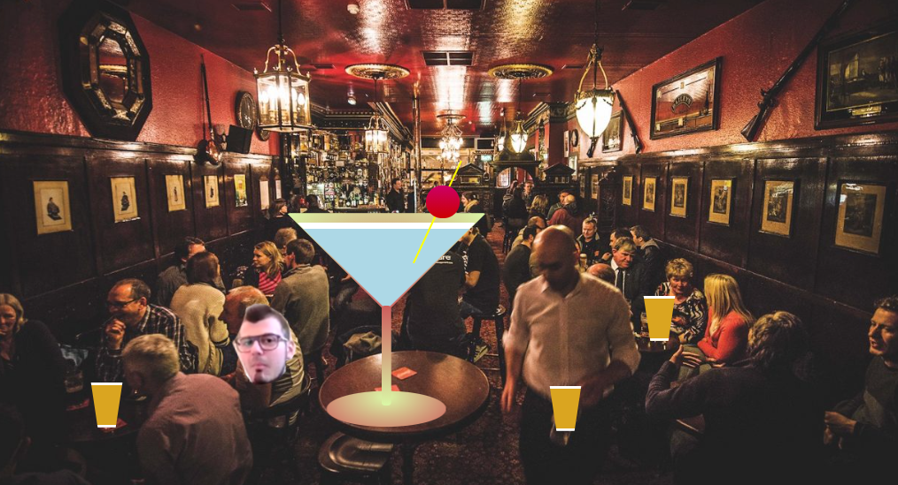

# React Animation Challenge

#### School Of Code Bootcamp

###### November 2020

_On this particular afternoon we were exploring some React Animation libraries for the first time. We were given the challenge of animating a place we love and perhaps somewhere we couldn't visit at the moment, so of course we chose the pub!_

## Main Learning Points:

- an animation and gesture library called [Motion API](https://www.framer.com/api/motion/)
- we found the docs really useful and clear and were able to implement some basic animation on our webpage combining our new found knowledge with some CSS drawings we did (a beer and cocktail!)
- the benefits of React animation libraries over other CSS animations are that they help keep your code maintainable and scalable, and they provide a more integrated way to control animations in your React components
- in general, you might want to use CSS animations for simpler "one-shot" transitions, like toggling UI element states but it is probably easier and better to use use JavaScript animations when you want to have advanced effects like bouncing, stop, pause, rewind, or slow down

## Built with:

- HTML
- CSS
- JavaScript
- React
- [Motion API](https://www.framer.com/api/motion/)

## Getting Started:

Clone the repo as instructed below

## Prerequisites:

Download and install npm modules

## Installation

1.  Clone the repo

`git clone https://github.com/katiehawcutt/react-animation-challenge.git`

2. Install the required npm modules

`npm i`

3. Start the application

`npm start`

## Usage

Have a go at moving a few pints around. You can also tip a giant cocktail on your person of choice! Click on the moving face to change to another person and click on the cocktail to tip it on them!
